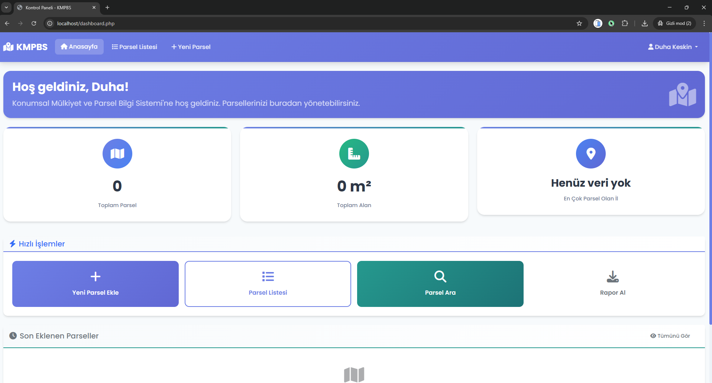
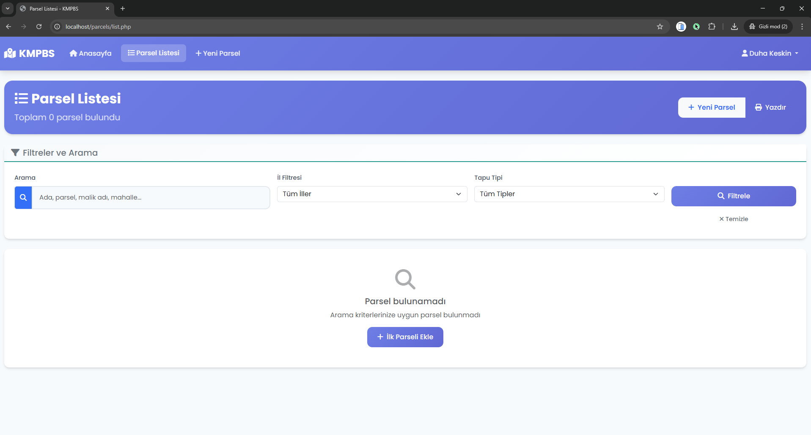

# Konumsal Mülkiyet ve Parsel Bilgi Sistemi (KMPBS)

<div align="center">
  <h3>🎓 Bursa Teknik Üniversitesi - Bilgisayar Mühendisliği</h3>
  <h4>Web Tabanlı Programlama Dersi Projesi</h4>
  <p><strong>Duha KESKİN</strong</p>
  <p><strong>Öğrenci No:</strong> 22360859003</p>
  <p><strong>Youtube Linki:</strong> https://youtu.be/hclBBCv6TcQ</p>
  <p>Modern ve kullanıcı dostu bir web tabanlı parsel yönetim sistemi</p>
  
  
  
  
  
  
</div>

---




## 📋 Proje Hakkında

Bu proje, **Bursa Teknik Üniversitesi Bilgisayar Mühendisliği Bölümü** **Web Tabanlı Programlama** dersi kapsamında geliştirilmiştir. Ada-parsel bilgilerinin dijital ortamda yönetilmesi için tasarlanmış kapsamlı bir web uygulamasıdır.

Kullanıcılar bu sistem sayesinde:

- 🏠 Parsel bilgilerini ekleyebilir
- ✏️ Mevcut kayıtları düzenleyebilir
- 🗑️ Gereksiz kayıtları silebilir
- 📊 Detaylı listeler halinde görüntüleyebilir

## ✨ Özellikler

### 🔐 Kullanıcı Yönetimi

- ✅ **Güvenli kayıt sistemi** - Kullanıcı dostu kayıt formu
- ✅ **Şifreli giriş** - password_hash ile güvenli şifreleme
- ✅ **Session yönetimi** - Güvenli oturum takibi
- ✅ **Güvenli çıkış** - Oturum sonlandırma

### 🗺️ Parsel Yönetimi

- ✅ **Yeni parsel ekleme** - Detaylı form ile kayıt
- ✅ **Parsel listesi** - Sayfalı görüntüleme
- ✅ **Parsel düzenleme** - Anlık güncelleme
- ✅ **Parsel silme** - Güvenli silme işlemi
- ✅ **Gelişmiş arama** - Çoklu kriterde filtreleme
- ✅ **Sayfalama** - Performanslı listeleme

### 📊 Gelişmiş Özellikler

- ✅ **İstatistiksel dashboard** - Özet bilgiler
- ✅ **Koordinat yönetimi** - GPS koordinat desteği
- ✅ **TC Kimlik doğrulama** - 11 haneli TC kontrolü
- ✅ **Responsive tasarım** - Tüm cihazlarda uyumlu
- ✅ **Yazdırma desteği** - Print friendly
- ✅ **Modern UI/UX** - Kullanıcı dostu arayüz

## 🛠️ Kullanılan Teknolojiler

| Kategori          | Teknoloji      | Açıklama                              |
| ----------------- | -------------- | ------------------------------------- |
| **Backend**       | PHP 7.4+       | Sade PHP (Framework kullanılmamıştır) |
| **Veritabanı**    | MySQL 5.7+     | İlişkisel veritabanı                  |
| **Frontend**      | HTML5, CSS3    | Modern web standartları               |
| **CSS Framework** | Bootstrap 5    | Responsive tasarım                    |
| **JavaScript**    | Vanilla JS     | Framework kullanılmamıştır            |
| **İkonlar**       | Font Awesome 6 | Modern ikon kütüphanesi               |

## 📁 Proje Yapısı

```
├── index.php                 # Ana giriş sayfası
├── register.php              # Kayıt sayfası
├── dashboard.php             # Kontrol paneli
├── AI.md                     # Yapay zeka sohbet geçmişi
├── README.md                 # Bu dosya
├── config/
│   └── database.php          # Veritabanı bağlantısı
├── auth/
│   ├── login.php            # Giriş işlemi
│   ├── register.php         # Kayıt işlemi
│   └── logout.php           # Çıkış işlemi
├── parcels/
│   ├── add.php              # Parsel ekleme
│   ├── process_add.php      # Parsel ekleme işlemi
│   ├── list.php             # Parsel listesi
│   ├── edit.php             # Parsel düzenleme
│   └── delete.php           # Parsel silme
└── assets/
    ├── css/
    │   └── style.css        # Ana stil dosyası
    └── js/
        └── main.js          # Ana JavaScript dosyası
```

## 🗃️ Veritabanı Yapısı

### users Tablosu

```sql
CREATE TABLE users (
    id INT AUTO_INCREMENT PRIMARY KEY,
    first_name VARCHAR(50) NOT NULL COMMENT 'Kullanıcı adı',
    last_name VARCHAR(50) NOT NULL COMMENT 'Kullanıcı soyadı',
    email VARCHAR(100) UNIQUE NOT NULL COMMENT 'E-posta adresi',
    password VARCHAR(255) NOT NULL COMMENT 'Şifreli parola',
    phone VARCHAR(20) COMMENT 'Telefon numarası',
    created_at TIMESTAMP DEFAULT CURRENT_TIMESTAMP,
    updated_at TIMESTAMP DEFAULT CURRENT_TIMESTAMP ON UPDATE CURRENT_TIMESTAMP
) ENGINE=InnoDB DEFAULT CHARSET=utf8mb4 COLLATE=utf8mb4_unicode_ci;
```

### parcels Tablosu

```sql
CREATE TABLE parcels (
    id INT AUTO_INCREMENT PRIMARY KEY,
    user_id INT NOT NULL COMMENT 'Kullanıcı ID',
    ada_no VARCHAR(20) NOT NULL COMMENT 'Ada numarası',
    parsel_no VARCHAR(20) NOT NULL COMMENT 'Parsel numarası',
    il VARCHAR(50) NOT NULL COMMENT 'İl bilgisi',
    ilce VARCHAR(50) NOT NULL COMMENT 'İlçe bilgisi',
    mahalle VARCHAR(100) NOT NULL COMMENT 'Mahalle bilgisi',
    alan DECIMAL(12,2) NOT NULL COMMENT 'Parsel alanı (m²)',
    tapu_tipi ENUM('mülk', 'kira', 'intifa', 'irtifak') NOT NULL COMMENT 'Tapu türü',
    malik_adi VARCHAR(100) NOT NULL COMMENT 'Malik adı',
    malik_soyadi VARCHAR(100) NOT NULL COMMENT 'Malik soyadı',
    malik_tc VARCHAR(11) NOT NULL COMMENT 'TC Kimlik No',
    adres TEXT COMMENT 'Detay adres',
    koordinat_x DECIMAL(10,8) COMMENT 'X koordinatı',
    koordinat_y DECIMAL(11,8) COMMENT 'Y koordinatı',
    aciklama TEXT COMMENT 'Ek açıklamalar',
    created_at TIMESTAMP DEFAULT CURRENT_TIMESTAMP,
    updated_at TIMESTAMP DEFAULT CURRENT_TIMESTAMP ON UPDATE CURRENT_TIMESTAMP,
    FOREIGN KEY (user_id) REFERENCES users(id) ON DELETE CASCADE,
    UNIQUE KEY unique_parcel (ada_no, parsel_no, il, ilce)
) ENGINE=InnoDB DEFAULT CHARSET=utf8mb4 COLLATE=utf8mb4_unicode_ci;
```

## 🚀 Kurulum ve Çalıştırma

### 📋 Gereksinimler

```bash
✅ PHP 7.4 veya üstü
✅ MySQL 5.7 veya üstü
✅ Apache/Nginx web sunucusu
✅ PDO PHP eklentisi
```

### 📁 Kurulum Adımları

1. **Projeyi İndirin**

   ```bash
   git clone [repository-url]
   cd parsel-sistemi
   ```

2. **Dosyaları Web Sunucusuna Kopyalayın**

   - Proje dosyalarını `htdocs` veya `www` dizinine yerleştirin

3. **Veritabanı Ayarları**

   `config/database.php` dosyasını düzenleyin:

   ```php
   private $host = 'localhost';        // Veritabanı sunucusu
   private $db_name = 'parsel_sistemi'; // Veritabanı adı
   private $username = 'root';          // Kullanıcı adı
   private $password = '';              // Şifre
   ```

4. **Veritabanı Oluşturma**

   ```sql
   CREATE DATABASE parsel_sistemi CHARACTER SET utf8mb4 COLLATE utf8mb4_unicode_ci;
   ```

5. **Uygulamayı Başlatın**
   - Tarayıcınızda `http://localhost/[proje-dizini]` adresine gidin
   - Tablolar otomatik oluşturulacaktır

## 📖 Kullanım Kılavuzu

### 🔐 İlk Kullanım

1. **Kayıt Olun**

   - Ana sayfada "Kayıt Ol" butonuna tıklayın
   - Form bilgilerini eksiksiz doldurun
   - E-posta adresinizin benzersiz olması gerekir

2. **Giriş Yapın**
   - Kayıt sonrası otomatik giriş yapılır
   - Veya "Giriş Yap" ile manuel giriş yapabilirsiniz

### 🏠 Parsel İşlemleri

| İşlem         | Açıklama             | Nasıl Yapılır                  |
| ------------- | -------------------- | ------------------------------ |
| **Ekleme**    | Yeni parsel kaydı    | Dashboard → "Yeni Parsel Ekle" |
| **Listeleme** | Tüm parselleri görme | "Parsel Listesi" menüsü        |
| **Arama**     | Parsel bulma         | Arama kutusuna kriter girin    |
| **Düzenleme** | Parsel güncelleme    | Listede ✏️ ikonuna tıklayın    |
| **Silme**     | Parsel kaldırma      | Listede 🗑️ ikonuna tıklayın    |

## 🔒 Güvenlik Özellikleri

- 🛡️ **Şifre Güvenliği** - PHP password_hash() kullanımı
- 🛡️ **SQL Injection Koruması** - PDO prepared statements
- 🛡️ **XSS Koruması** - htmlspecialchars() filtreleme
- 🛡️ **Session Güvenliği** - Güvenli oturum yönetimi
- 🛡️ **Input Validasyonu** - Tüm girişlerde kontrol
- 🛡️ **CSRF Koruması** - Cross-site request forgery koruması

## 📱 Responsive Tasarım

<div align="center">

| Cihaz          | Desteklenen Boyutlar | Optimizasyon   |
| -------------- | -------------------- | -------------- |
| 📱 **Mobil**   | 320px - 767px        | Touch-friendly |
| 📟 **Tablet**  | 768px - 991px        | Hybrid layout  |
| 💻 **Desktop** | 992px+               | Full feature   |

</div>

## 🎨 UI/UX Tasarım Prensipleri

- ✨ **Modern Tasarım** - Güncel web standartları
- 🎯 **Kullanıcı Odaklı** - Kolay navigasyon
- 🎨 **Görsel Tutarlılık** - Consistent design system
- ⚡ **Hızlı Erişim** - Minimal tık gereksinimi
- 📢 **Anlaşılır Mesajlar** - Net geri bildirim
- ⏳ **Loading Göstergeleri** - İşlem durumu takibi

## 📊 Veritabanı Şeması

### 👥 users Tablosu

```sql
CREATE TABLE users (
    id INT AUTO_INCREMENT PRIMARY KEY,
    first_name VARCHAR(50) NOT NULL COMMENT 'Kullanıcı adı',
    last_name VARCHAR(50) NOT NULL COMMENT 'Kullanıcı soyadı',
    email VARCHAR(100) UNIQUE NOT NULL COMMENT 'E-posta adresi',
    password VARCHAR(255) NOT NULL COMMENT 'Şifreli parola',
    phone VARCHAR(20) COMMENT 'Telefon numarası',
    created_at TIMESTAMP DEFAULT CURRENT_TIMESTAMP,
    updated_at TIMESTAMP DEFAULT CURRENT_TIMESTAMP ON UPDATE CURRENT_TIMESTAMP
) ENGINE=InnoDB DEFAULT CHARSET=utf8mb4 COLLATE=utf8mb4_unicode_ci;
```

### 🏠 parcels Tablosu

```sql
CREATE TABLE parcels (
    id INT AUTO_INCREMENT PRIMARY KEY,
    user_id INT NOT NULL COMMENT 'Kullanıcı ID',
    ada_no VARCHAR(20) NOT NULL COMMENT 'Ada numarası',
    parsel_no VARCHAR(20) NOT NULL COMMENT 'Parsel numarası',
    il VARCHAR(50) NOT NULL COMMENT 'İl bilgisi',
    ilce VARCHAR(50) NOT NULL COMMENT 'İlçe bilgisi',
    mahalle VARCHAR(100) NOT NULL COMMENT 'Mahalle bilgisi',
    alan DECIMAL(12,2) NOT NULL COMMENT 'Parsel alanı (m²)',
    tapu_tipi ENUM('mülk', 'kira', 'intifa', 'irtifak') NOT NULL COMMENT 'Tapu türü',
    malik_adi VARCHAR(100) NOT NULL COMMENT 'Malik adı',
    malik_soyadi VARCHAR(100) NOT NULL COMMENT 'Malik soyadı',
    malik_tc VARCHAR(11) NOT NULL COMMENT 'TC Kimlik No',
    adres TEXT COMMENT 'Detay adres',
    koordinat_x DECIMAL(10,8) COMMENT 'X koordinatı',
    koordinat_y DECIMAL(11,8) COMMENT 'Y koordinatı',
    aciklama TEXT COMMENT 'Ek açıklamalar',
    created_at TIMESTAMP DEFAULT CURRENT_TIMESTAMP,
    updated_at TIMESTAMP DEFAULT CURRENT_TIMESTAMP ON UPDATE CURRENT_TIMESTAMP,
    FOREIGN KEY (user_id) REFERENCES users(id) ON DELETE CASCADE,
    UNIQUE KEY unique_parcel (ada_no, parsel_no, il, ilce)
) ENGINE=InnoDB DEFAULT CHARSET=utf8mb4 COLLATE=utf8mb4_unicode_ci;
```

---

## 📄 Lisans

Bu repo **Bursa Teknik Üniversitesi Web Tabanlı Programlama** dersi projesi olarak hazırlanmıştır.

---
